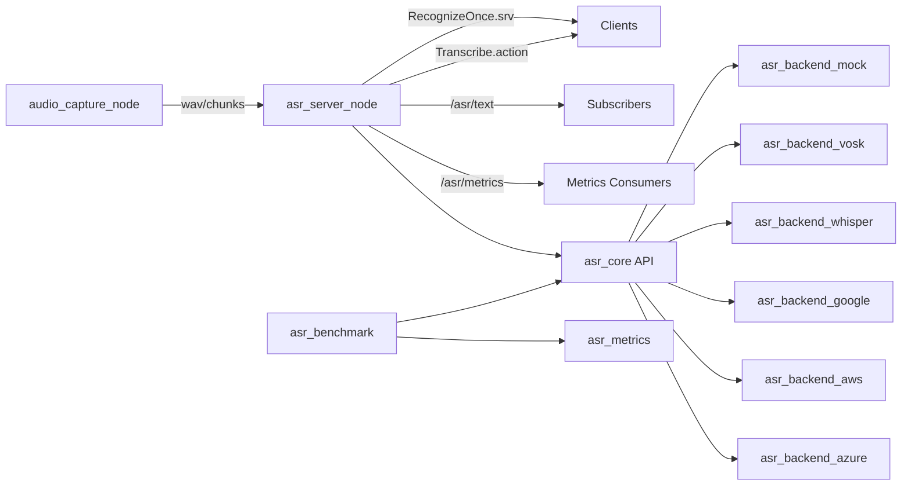

# Architecture

## High-Level

## Modules

- `asr_core`: shared data models, backend contract, runtime backend factory.
- `asr_ros`: ROS2 nodes, lifecycle-like state management, service/action endpoints, topic publishing.
- `asr_metrics`: WER/CER/RTF + system resource stats + artifact I/O + plots.
- `asr_benchmark`: benchmark scenarios (clean/noisy/streaming simulation) and result persistence.
- `asr_backend_*`: provider-specific integrations behind unified API.

## Design Rules

- Backend is selected only via config/parameters.
- Capability flags are explicit (streaming native/simulated, confidence availability).
- Cloud calls are injectable/testable and never required for default CI path.
- Fail-safe behavior: no mic -> file mode, no GPU -> CPU, no cloud creds -> skip cloud tests.
- Live ingest path: `audio_capture_node` publishes `/asr/audio_chunks`, `asr_server_node` buffers until short silence timeout, then publishes final result to `/asr/text`.
