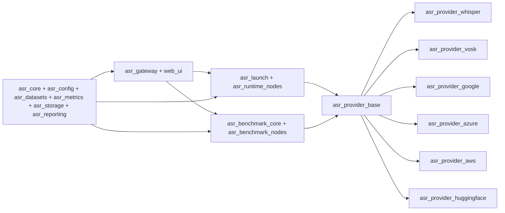

# Architecture

## Canonical Layers

## Active Packages

- `asr_core`, `asr_config`, `asr_datasets`, `asr_metrics`, `asr_storage`, `asr_reporting`
- `asr_provider_base`, `asr_provider_*`
- `asr_runtime_nodes`, `asr_benchmark_core`, `asr_benchmark_nodes`
- `asr_gateway`, `asr_launch`, `web_ui`

## Archived Surface

- Historical runtime, benchmark, backend-wrapper packages, flat configs, and compatibility scripts live under top-level `legacy/`.
- They are not part of default `colcon`, `pytest`, `ruff`, `mypy`, or `make build` flows.

## Design Rules

- Runtime and benchmark select providers only through profile-driven configuration.
- Provider packages own provider implementation details and normalize outputs into `NormalizedAsrResult`.
- Gateway and UI talk to the canonical runtime and benchmark surfaces, not archived compatibility packages.
