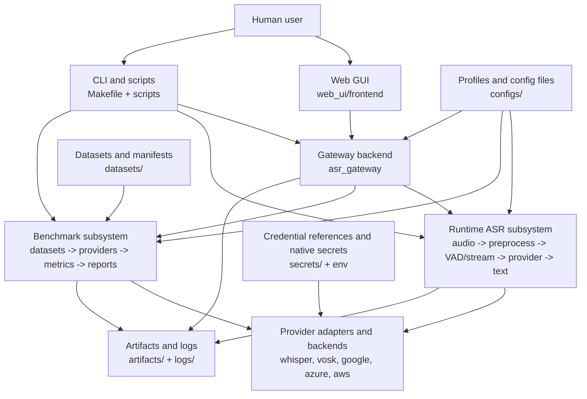
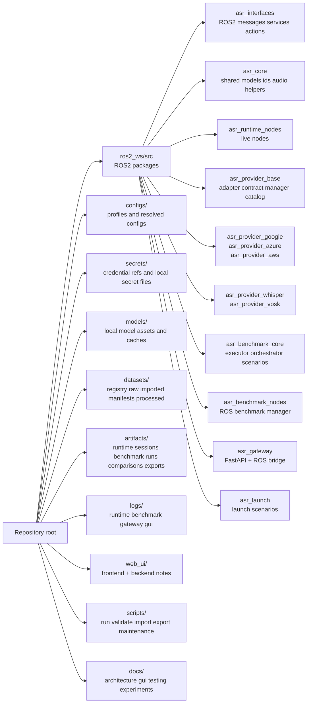
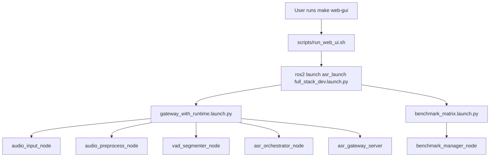
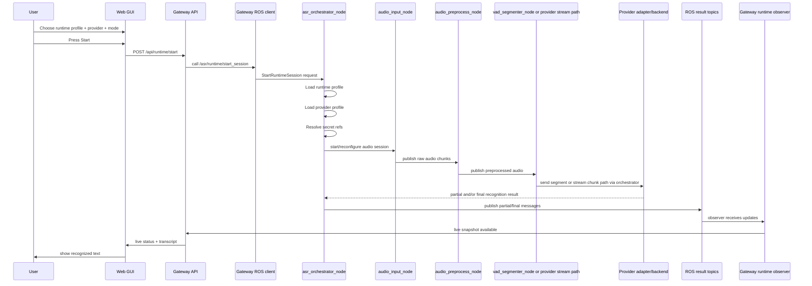
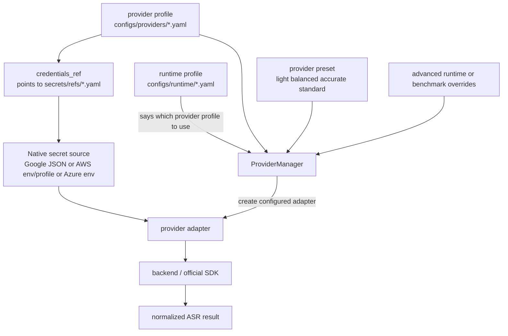
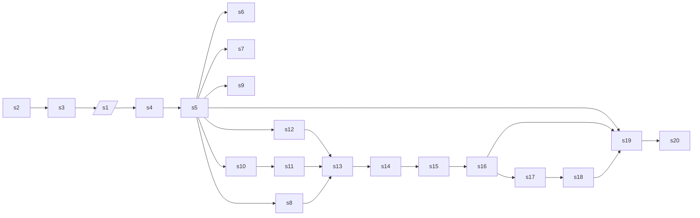
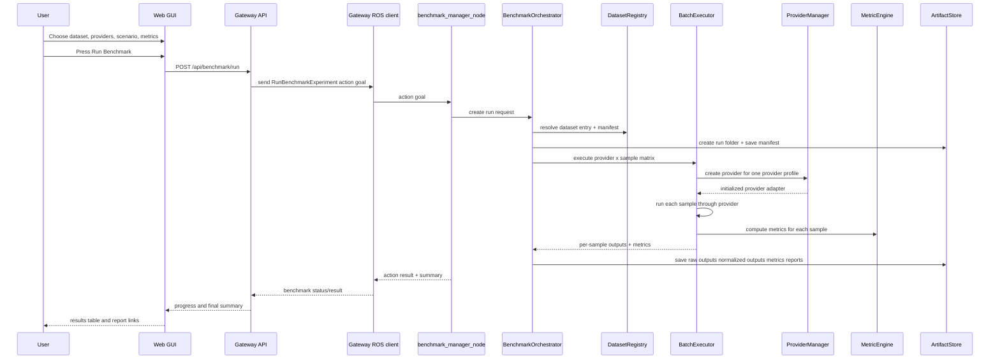
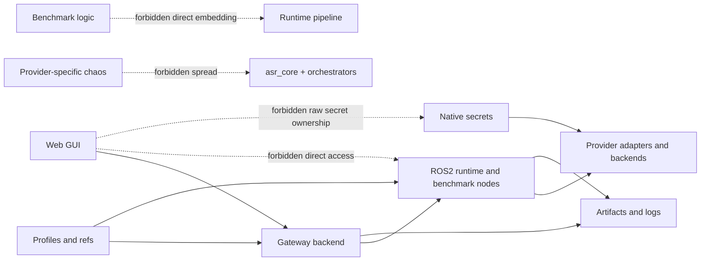
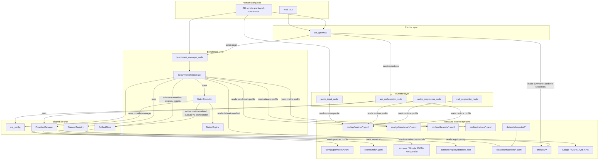

# Project Explained From Zero

This document is a human-friendly explanation pack for the whole project.
It is written for a reader who may know nothing about ROS2, ASR, cloud speech APIs, benchmarking, or engineering repository structure.

If you need to explain the project in a demo, defense, report, onboarding session, or bachelor thesis presentation, start here.

## What This Project Is In One Sentence

This repository is a modular speech-recognition platform for robotics.
It can do two big jobs:

- Runtime ASR: listen to audio and produce recognized text during operation.
- Benchmark ASR: run controlled experiments on datasets, compare providers, calculate metrics, and save reproducible results.

## The Main Idea In Plain Language

Think of the project as a small factory.

- The `runtime` part is the live production line.
  It takes sound in, cleans it, detects speech, sends it to the chosen speech engine, and publishes text out.
- The `benchmark` part is the testing laboratory.
  It takes many prepared audio samples, runs them through one or more speech engines, measures quality and speed, and writes reports.
- The `gateway + GUI` part is the control room.
  It lets a human start, stop, configure, inspect, and compare the system without directly touching ROS2 internals.
- The `configs`, `secrets`, `datasets`, and `artifacts` folders are the knowledge base and warehouse.
  They store instructions, credentials, input data, and outputs.

## How To Read This Pack

Fast route:
1. Read Diagram 1.
2. Read Diagram 3.
3. Read Diagram 5.
4. Read Diagram 7.

Full route:
1. Diagram 1: whole system in one picture.
2. Diagram 2: what lives where in the repository.
3. Diagram 3: who starts whom.
4. Diagram 4: runtime data path.
5. Diagram 5: live runtime sequence.
6. Diagram 6: how provider selection/config/secrets work.
7. Diagram 7: benchmark pipeline.
8. Diagram 8: benchmark sequence.
9. Diagram 9: artifacts and storage.
10. Diagram 10: rules and architectural boundaries.
11. Diagram 11: who reads what, who writes what, and where each truth source lives.

## Top Diagrams And Why They Were Chosen

1. Diagram 1 answers: What are the main subsystems?
2. Diagram 2 answers: Where is everything in the repository?
3. Diagram 3 answers: Who starts whom?
4. Diagram 4 answers: How does live recognition actually flow?
5. Diagram 5 answers: What happens after the user presses Start?
6. Diagram 6 answers: How does the system choose and configure a provider?
7. Diagram 7 answers: How does a benchmark run work from end to end?
8. Diagram 8 answers: What happens after the user presses Run Benchmark?
9. Diagram 9 answers: Where do results and reports physically go?
10. Diagram 10 answers: What is allowed to talk to what, and why?
11. Diagram 11 answers: Which component actually reads configs, secrets, datasets, topics, and artifacts?

## Diagram 1. Whole Project In One Picture

Question this diagram answers:
What are the biggest parts of the platform and how do they relate?



Read it in simple words:
- A person can use the system through the GUI or through scripts/terminal.
- The GUI does not directly operate ROS2 internals.
  It goes through the gateway.
- The runtime subsystem handles live recognition.
- The benchmark subsystem handles experiments.
- Both runtime and benchmark use the same provider layer.
- Configs tell the system what to do.
- Secrets let cloud providers authenticate.
- Datasets feed benchmarks.
- Storage keeps results, logs, and reports.

Why this matters:
This is the clean boundary that keeps the project modular instead of becoming one giant application.

## Diagram 2. What Lives Where In The Repository

Question this diagram answers:
If I open the repository, where do I find each kind of thing?



Read it in simple words:
- `ros2_ws/src` is where the actual software packages live.
- `configs` describes how to run the system.
- `secrets` describes how to authenticate providers.
- `datasets` stores benchmark input data and manifests.
- `artifacts` stores outputs.
- `docs` explains the system.

Why this matters:
A clean repository layout is what lets the project grow without turning into chaos.

## Diagram 3. Who Starts Whom

Question this diagram answers:
When we run the project, which process launches which other process?



Read it in simple words:
- `make web-gui` does not directly run all Python files by hand.
- It calls `scripts/run_web_ui.sh`.
- That script starts a ROS2 launch file.
- The top launch file includes one launch for runtime + gateway and one launch for benchmark manager.
- Those included launch files start the actual nodes/processes.

Why this matters:
This is the answer to “who brings the system up?” and “why do several processes appear at once?”.

## Diagram 4. Runtime Data Flow

Question this diagram answers:
How does live speech become recognized text?

```mermaid
flowchart LR
    Mic[Microphone input] --> AudioInput[audio_input_node]
    File[WAV file input] --> AudioInput

    AudioInput -->|publishes raw chunks| RawTopic[/asr/runtime/audio/raw]
    RawTopic --> AudioPreprocess[audio_preprocess_node]
    AudioPreprocess -->|publishes cleaned chunks| PreTopic[/asr/runtime/audio/preprocessed]

    PreTopic --> StreamPath[Provider stream path\nwhen processing_mode=provider_stream]
    PreTopic --> VAD[vad_segmenter_node\nwhen processing_mode=segmented]

    VAD -->|publishes activity| VadTopic[/asr/runtime/vad/activity]
    VAD -->|publishes speech segments| SegTopic[/asr/runtime/audio/segments]

    StreamPath --> Orchestrator[asr_orchestrator_node]
    SegTopic --> Orchestrator

    Orchestrator --> ProviderManager[ProviderManager]
    ProviderManager --> Provider[Provider adapter]
    Provider --> Backend[Provider backend / SDK]
    Backend --> LocalOrCloud[Local engine or cloud API]

    Orchestrator -->|publishes partials| PartialTopic[/asr/runtime/results/partial]
    Orchestrator -->|publishes finals| FinalTopic[/asr/runtime/results/final]
    Orchestrator -->|publishes health| StatusTopic[/asr/status/nodes + /asr/status/sessions]
```

Read it in simple words:
- Audio enters through the input node.
- The preprocess node cleans and normalizes it.
- Then the system has two possible runtime modes.

Mode 1: segmented mode.
- VAD detects where speech starts and stops.
- The orchestrator receives complete segments.
- Good when you want clear phrase boundaries.

Mode 2: provider stream mode.
- The orchestrator forwards cleaned chunks straight into a streaming-capable provider.
- Good when the provider can produce partial results while audio is still flowing.

Then:
- The orchestrator asks the chosen provider to recognize the speech.
- It converts the provider-specific output into one normalized project format.
- It publishes results and statuses to ROS topics.

Why this matters:
This is the core live recognition pipeline of the whole platform.

## Diagram 5. What Happens When The User Presses Start Runtime

Question this diagram answers:
What exactly happens from GUI click to recognized text?



Read it in simple words:
- The GUI sends a normal HTTP request to the gateway.
- The gateway translates that into a ROS2 service call.
- The orchestrator becomes the runtime coordinator.
- The audio path starts flowing.
- Results come back through ROS topics.
- The gateway observer listens to those topics and exposes them back to the GUI.

Why this matters:
This is the clearest answer to “why the GUI is not the brain of the system”.
The GUI only asks.
The gateway bridges.
The runtime nodes do the real work.

## Diagram 6. How Provider Selection, Profiles, And Secrets Work

Question this diagram answers:
How does the system know which backend to use and how to authenticate it?



Read it in simple words:
- A runtime profile describes the high-level session.
- A provider profile describes one provider configuration.
- A preset is a friendly named bundle like `balanced` or `accurate`.
- Advanced overrides let the user change details for one run.
- The provider manager merges all of that and creates the actual provider adapter.
- If the provider needs credentials, the provider profile does not store raw secrets.
  It stores a reference to where the secret should be found.
- The backend then uses the official SDK/API with those credentials.

Why this matters:
This is what keeps provider logic clean, modular, and not hardcoded all over the repository.

## Diagram 7. Benchmark Pipeline

Question this diagram answers:
How does the system run reproducible ASR experiments?



Read it in simple words:
- A benchmark run starts as a request.
- The benchmark manager receives it.
- The orchestrator resolves all profiles.
- The dataset registry tells it where the dataset manifest lives.
- The manifest lists the samples to test.
- The executor runs provider x sample combinations.
- Outputs are measured by the metric engine.
- Everything gets saved to artifacts with a stable run ID.

Why this matters:
This is what makes the project a research/evaluation platform, not only a live demo tool.

## Diagram 8. What Happens When The User Presses Run Benchmark

Question this diagram answers:
What exactly happens from GUI click to finished benchmark report?



Read it in simple words:
- The GUI asks the gateway to start a benchmark.
- The gateway does not run it itself.
  It sends an action goal into ROS2.
- The benchmark manager and orchestrator do the work.
- The artifact store writes the immutable run manifest first.
- Then results and reports are saved.
- The GUI later reads the saved outputs back through the gateway.

Why this matters:
This is the path that makes benchmark runs reproducible and inspectable.

## Diagram 9. Where Results Go On Disk

Question this diagram answers:
After the system runs, where do files physically appear?

```mermaid
flowchart TB
    Repo[Repository root]

    Repo --> ConfigRoot[configs/]
    ConfigRoot --> Resolved[configs/resolved/\nresolved snapshots used for runs]

    Repo --> DatasetRoot[datasets/]
    DatasetRoot --> Registry[datasets/registry/]
    DatasetRoot --> Raw[datasets/raw/]
    DatasetRoot --> Imported[datasets/imported/]
    DatasetRoot --> Manifests[datasets/manifests/]
    DatasetRoot --> Processed[datasets/processed/]
    DatasetRoot --> Noise[datasets/noise_assets/]

    Repo --> ArtifactRoot[artifacts/]
    ArtifactRoot --> RuntimeSessions[artifacts/runtime_sessions/<session_id>/]
    RuntimeSessions --> RSRaw[raw/]
    RuntimeSessions --> RSNorm[normalized/]
    RuntimeSessions --> RSMetrics[metrics/]
    RuntimeSessions --> RSLogs[logs/]

    ArtifactRoot --> BenchRuns[artifacts/benchmark_runs/<run_id>/]
    BenchRuns --> Manifest[manifest/run_manifest.json]
    BenchRuns --> Snapshots[resolved_configs/]
    BenchRuns --> RawOutputs[raw_outputs/]
    BenchRuns --> NormOutputs[normalized_outputs/]
    BenchRuns --> Metrics[metrics/results.json + results.csv]
    BenchRuns --> Reports[reports/summary.json + summary.md]
    BenchRuns --> Logs[logs/]

    ArtifactRoot --> Comparisons[comparisons/]
    ArtifactRoot --> Exports[exports/]
```



Read it in simple words:
- Resolved configs are frozen snapshots of what settings were actually used.
- Runtime sessions have their own folders.
- Benchmark runs have their own folders.
- A benchmark run stores both technical traces and human-readable reports.

Why this matters:
This is the heart of reproducibility.
A run can be revisited later because its inputs and outputs are saved in a stable place.

## Diagram 10. Hard Architectural Boundaries

Question this diagram answers:
What is intentionally allowed and what is intentionally forbidden?



Read it in simple words:
- GUI may talk to gateway.
- Gateway may talk to ROS.
- ROS may talk to providers.
- Secrets go to providers, not to the GUI state as plain values.
- Benchmark logic and runtime logic are related, but they are not the same subsystem.
- Provider-specific behavior is isolated behind adapter boundaries.

Why this matters:
This is the design discipline that keeps the system understandable and extensible.

## Diagram 11. Who Reads What, Who Writes What, And Where Truth Lives

Question this diagram answers:
When people ask "who actually reads this file?" or "who is the source of truth for this state?", what is the concrete answer?



Read it in simple words:
- The GUI is not the source of truth for runtime state.
  It asks the gateway.
- The gateway is not the source of truth for recognition results.
  It reads ROS topics and artifact summaries.
- Runtime nodes read runtime profiles.
- The provider manager reads provider profiles and secret references.
- Secret references point to native credential sources.
- Benchmark orchestration reads benchmark, dataset, provider, and metric profiles.
- The artifact store is the component that writes the official on-disk run outputs.

The most important "truth sources" are:
- live runtime state: ROS topics and runtime services/actions
- provider configuration: provider profiles plus resolved secret refs
- dataset definition: dataset profile plus dataset manifest
- benchmark reproducibility: run manifest inside `artifacts/benchmark_runs/<run_id>/manifest/run_manifest.json`
- human dashboards and reports: files already written to artifacts and then read back through the gateway

Why this matters:
This is the answer to the most common architecture confusion:
"Is the GUI state the real state?" No.
"Is a profile itself the run record?" No.
"Is a provider profile also a secret file?" No.
"Where do I inspect what really happened?" In ROS live topics for runtime and in artifacts for completed runs.

## The Most Important Principles Behind The Architecture

1. ROS2-first, not GUI-first.
The real system lives in ROS2 packages, nodes, topics, services, and actions.

2. Runtime and benchmark are siblings, not one blob.
They share contracts and utilities, but they are not merged into one monolith.

3. Providers are isolated behind adapters.
This prevents Google/Azure/AWS/Whisper/Vosk details from leaking everywhere.

4. Results are normalized.
All providers produce one common result shape.
That makes GUI, metrics, storage, and comparisons possible.

5. Configs are profile-driven.
The system does not randomly read YAML all over the codebase.
It resolves profiles with a defined precedence model.

6. Secrets are references, not inline values.
Provider profiles say where secrets come from, but do not embed secrets directly.

7. Benchmark runs are reproducible by design.
Each run writes a manifest, snapshots, outputs, metrics, and reports.

8. The gateway is the human-safe boundary.
It protects the core from turning into GUI-owned business logic.

## Minimal Glossary

- ROS2 node: a running process with one clear responsibility.
- Topic: a channel where nodes publish/subscribe messages.
- Service: a request/response call.
- Action: a long-running request with progress.
- Runtime profile: a profile for live recognition behavior.
- Provider profile: a profile for one ASR backend configuration.
- Dataset manifest: a list of audio samples and their reference texts.
- Artifact: a saved output file from runtime or benchmark execution.
- Normalized result: one common ASR result format used across providers.
- VAD: voice activity detection, the logic that decides where speech starts and stops.

## What To Open Next If You Want More Detail

- Runtime details: [runtime_architecture.md](docs/architecture/runtime_architecture.md)
- Benchmark details: [benchmark_architecture.md](docs/architecture/benchmark_architecture.md)
- Provider layer: [provider_model.md](docs/architecture/provider_model.md)
- Config resolution: [config_model.md](docs/architecture/config_model.md)
- GUI/gateway boundary: [gui_gateway_model.md](docs/architecture/gui_gateway_model.md)
- Storage layout: [storage_artifacts.md](docs/architecture/storage_artifacts.md)
- Beginner route: [newbie_guide.md](docs/newbie_guide.md)

## Best Use Cases For These Diagrams

- Bachelor thesis architecture chapter.
- Demo explanation to supervisors or audience.
- Onboarding a new teammate.
- Explaining why the project is modular and ROS2-first.
- Showing the difference between runtime operation and benchmark experimentation.
- Explaining to a non-specialist where data enters, where it is transformed, and where the final outputs are stored.
