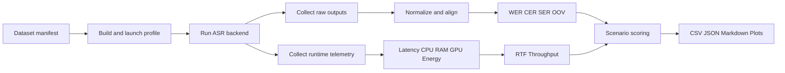
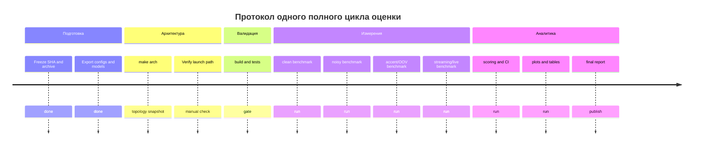

# Концепт оценки ASR для ros2_ASR

## Executive summary

Проект **ros2_ASR** в текущем доступном срезе выглядит как модульная ASR-платформа под ROS 2 Jazzy и Ubuntu 24.04 с единым API поверх локальных и облачных провайдеров, бенчмаркингом, генерацией отчётов и воспроизводимыми скриптами. В доступных артефактах прямо заявлены локальные бэкенды `mock`, `vosk`, `whisper`, облачные `google`, `aws`, `azure`, а также сценарии benchmark для clean/noisy, language variants и streaming simulation. Репозиторий предусматривает результаты в `results/*.csv`, `results/*.json`, `results/plots/*.png`, отдельный live-sample evaluation, topic `/asr/metrics`, а также автоматическую генерацию отчёта из `results/benchmark_results.json` в `results/report.md`. Это означает, что база для дипломного протокола оценки уже частично существует; задача бакалаврской работы — не начинать оценку “с нуля”, а привести её к строгой исследовательской методологии, стандартизовать метрики, нормализацию, доверительные интервалы и правила сравнения моделей. citeturn5view0turn5view1turn5view3

Высоконадежный вывод по доступным данным такой: проект уже ориентирован на production-like эксплуатацию и воспроизводимость, но для полноценного научного аудита сейчас недоступна значительная часть вложенного кода (`scripts/`, `docs/`, `ros2_ws/src/*`) в браузерной среде исследования, где обращения к этим путям возвращали `Cache miss`. Поэтому строгий отчёт должен различать две зоны уверенности: **подтверждённые факты** по корневым файлам и дереву репозитория и **предлагаемую методологию**, которая опирается на стандарты ASR и совместима с архитектурой проекта, но требует выгрузки полного исходного дерева для верификации реализации. Для воспроизводимого обмена артефактами репозиторий сам документирует `make dist`, создающий стерильный архив с `ros2_ws/src/**`, `docs/`, `configs/`, `scripts/`, sample data и `results/`, однако `.github/workflows/` и `.codex/` в составе релизного архива явно не перечислены и должны быть переданы отдельно для аудита автоматизации. citeturn10view0turn10view1turn10view2turn10view3turn5view0turn2view0

Ниже предложен полный исследовательский концепт: единая рамка метрик, формулы, нормализация, веса для четырёх сценариев, протокол экспериментов, шаблоны таблиц, JSON/CSV-манифесты, промпты для “кодекса” и пошаговый runbook. Ключевая рекомендация: в финальной дипломной оценке использовать **двухконтурную систему** — официальный контур качества на базе entity["organization","NIST","us standards institute"] SCTK для WER/SER и статистики различий, и инженерный контур телеметрии на уровне latency/RTF/CPU/RAM/GPU/energy через встроенные результаты ROS 2, `psutil`, `nvidia-smi`, Linux powercap и ROS tracing. Это даст одновременно научную корректность и инженерную применимость. citeturn25search0turn25search4turn32search0turn32search1turn35search2turn33search4turn39search4

## Аудит репозитория

По корневому дереву на entity["company","GitHub","developer platform"] подтверждаются каталоги `.codex`, `.github/workflows`, `artifacts`, `configs`, `data`, `datasets`, `docs`, `legacy`, `logs`, `models`, `reports`, `results`, `ros2_ws`, `scripts`, `tests`, `tools`, `web_ui`, а также большое количество audit/refactor markdown-артефактов. README позиционирует проект как “Universal ASR for ROS2 Jazzy”, подчёркивает production-oriented модульность и воспроизводимость. Корневой Makefile документирует стандартный цикл `setup → build → test-unit / test-ros / test-colcon → bench → report → arch → dist`. Это уже близко к структуре академического benchmark framework, где репозиторий одновременно содержит код, тесты, документацию и артефакты результатов. citeturn1view0turn2view0turn5view0turn5view1

Из доступных файлов видно, что проект рассчитывает на Python 3.12, `pytest`, `ruff`, `mypy`, `matplotlib`, `psutil`, `soundfile`, а среди ASR/облака — `vosk`, `faster-whisper`, `boto3`, `google-cloud-speech`, `azure-cognitiveservices-speech`. Это подтверждает, что в проекте, по меньшей мере, предусмотрены: локальные бэкенды, облачные адаптеры, системная телеметрия и построение графиков. Особенно важно наличие `psutil` и `matplotlib`: это делает реалистичным автоматический сбор CPU/RAM и автогенерацию trade-off графиков без внепроектных зависимостей. citeturn5view3turn5view2

Из README подтверждаются уже существующие точки сбора метрик и результаты: `make bench` создаёт CSV/JSON/PNG в `results/`; `make report` строит `results/report.md` из `results/benchmark_results.json`; live-sample evaluation пишет `live_results.json`, `live_results.csv`, `summary.md` и `plots/*.png`; для runtime-наблюдения есть `/asr/metrics`, а распознанный текст публикуется в `/asr/text` и `/asr/text/plain`. Для дипломной работы это особенно ценно: не нужно изобретать канал результатов, нужно стандартизовать схему run manifest и единую таблицу метрик поверх уже существующих артефактов. citeturn5view0turn5view1

Есть и архитектурный риск, который нужно явно зафиксировать в дипломе. Корневое дерево описывает “canonical stack” с пакетами вроде `asr_launch`, `asr_runtime_nodes`, `asr_provider_*`, `asr_benchmark_*`, `asr_gateway` и `web_ui`, но примеры запуска в README используют `ros2 launch asr_ros demo.launch.py` и `bringup.launch.py`. Это похоже на неполностью завершённый рефакторинг или совместимость с legacy-слоем. Следовательно, в протоколе оценки нужно всегда фиксировать **реальный исполняемый путь**, package name, launch file, backend, модель и git SHA: иначе можно случайно сравнить разные кодовые пути под похожими именами. citeturn2view0turn5view0

Главное ограничение исследования: в браузерной среде удалось надёжно открыть корневую страницу, README, Makefile, `pyproject.toml`, `requirements.txt`, но прямые обращения к вложенным `scripts/`, `docs/` и другим markdown/csv-файлам не были воспроизводимо доступны. Поэтому этот отчёт **не претендует на строчный аудит всего исходного кода**; он является строгим концептом оценки, максимально привязанным к подтверждённым артефактам. Для полного этапа диплома критичны следующие недостающие артефакты: `ros2_ws/src/**`, launch files, `scripts/run_benchmarks.sh`, `scripts/run_live_sample_eval.sh`, `scripts/generate_report.py`, `configs/*.yaml`, реальные примеры `results/*.json`, определения сообщений для `/asr/metrics`, содержимое `.github/workflows/` и `.codex/`. Оптимальный способ передачи — архив `make dist` плюс отдельная выгрузка `.github/workflows` и `.codex`. citeturn10view0turn10view1turn10view2turn10view3turn5view0turn2view0

## Рамка метрик и формул

Для официальной части качества речи базой должен быть инструментальный контур entity["organization","NIST","us standards institute"] SCTK: `sclite` остаётся де-факто стандартом для WER и связанных отчётов, а `sc_stats` поддерживает статистическое сравнение систем. Репозиторий SCTK прямо документирует `sclite`, `sc_stats`, `rover`, `asclite`, а NIST Tools перечисляет SCTK как официальный Speech Recognition Scoring Toolkit. Для статистических интервалов и сравнения WER целесообразно использовать paired bootstrap / bootstrap-t по Bisani & Ney; они показывают, что доверительные интервалы по WER надо строить по независимым сегментам, а при сравнении систем выгодно использовать парный bootstrap на одинаковых сегментах. Для confidence calibration разумно опираться на ECE/MCE/Brier; проблема некалиброванных confidence-estimates у современных моделей классическая, а в ASR появились уже и специализированные word/token-level методы оценки калибровки. Для шумовой устойчивости следует опираться на протоколы типа CHiME, специально созданные для реального шумного и реверберационного ASR. citeturn25search0turn25search4turn24search8turn36search0turn31search7turn31search16turn24search1turn24search7

Для метрик системных ресурсов в инженерном контуре достаточно опираться на официально документированные источники: `psutil` для CPU/RAM/процессов, `nvidia-smi` для GPU utilization, memory и power draw, Linux powercap/RAPL для `energy_uj` на CPU/DRAM, а на ROS 2 стороне — tracing и runtime introspection. Это важно, потому что диплом должен различать **качество распознавания** и **стоимость его получения**: две модели с одинаковым WER, но разным latency, RTF и energy, практически неэквивалентны для ROS-сценариев. ROS 2 tracing документирован как встроенная низконакладная трассировка на Linux; это делает возможным измерение end-to-end path latency не только на уровне Python-таймеров, но и на уровне callback/pub/sub цепочки. citeturn32search1turn32search0turn35search2turn33search4turn39search4

### Предлагаемый набор метрик

| Семейство | Метрика | Формула | Единицы | Интерпретация |
|---|---|---:|---:|---|
| Accuracy | WER | \((S + D + I) / N_{ref}\) | доля или % | Ниже лучше |
| Accuracy | CER | \((S_c + D_c + I_c) / N_{char}\) | доля или % | Ниже лучше |
| Accuracy | SER | \(\frac{1}{U}\sum 1[\hat{y}_u \neq y_u]\) | доля или % | Доля полностью ошибочных высказываний |
| Latency | First-token latency | \(t_{first\_emit} - t_{speech\_start}\) | ms | Ниже лучше |
| Latency | Final latency | \(t_{final} - t_{speech\_end}\) | ms | Ниже лучше |
| Latency | Average token delay | \(\frac{1}{K}\sum_k (t_{emit,k} - t_{audio,k})\) | ms | Для streaming UX |
| Speed | RTF | \(t_{proc}/t_{audio}\) | ratio | \(<1\) означает real-time быстрее входа |
| Speed | Throughput | \(T_{audio\_done}/t_{wall}\) или \(U/t_{wall}\) | audio-sec/sec, utt/sec | Выше лучше |
| Resources | CPU avg / p95 | среднее / p95 по run | % | Ниже лучше |
| Resources | Peak RAM / RSS | \(\max RSS_t\) | MB/GB | Ниже лучше |
| Resources | GPU mem / util | max memory, avg util | MB, % | Справочная и сравнительная |
| Energy | Energy per audio minute | \(E_{joule} / (t_{audio}/60)\) | J/audio-min | Ниже лучше |
| Confidence | ECE | \(\sum_b \frac{n_b}{n}\lvert acc(B_b)-conf(B_b)\rvert\) | доля | Ниже лучше |
| Confidence | Brier | \(\frac{1}{n}\sum_i (p_i-y_i)^2\) | score | Ниже лучше |
| Robustness | Noise degradation | \(WER_{noisy}-WER_{clean}\) или \(WER_{noisy}/WER_{clean}\) | p.p. или ratio | Ниже лучше |
| Robustness | Accent gap | \(\max_g WER_g - \min_g WER_g\) | p.p. | Ниже лучше |
| Vocabulary | OOV rate | \(N_{OOV}/N_{ref\_tokens}\) | доля или % | Ниже лучше |
| Deployment | Model size | размер артефакта модели | MB/GB | Ниже лучше |
| Economics | Cost per audio hour | прямые вычислительные или API-затраты / час аудио | валюта/audio-hour | Ниже лучше |

Для дипломного отчёта я рекомендую разделить метрики на **обязательные** и **диагностические**. Обязательные: WER, CER, SER, final latency, first-token latency, RTF, CPU avg, peak RAM, energy per audio minute, ECE, noise degradation, accent gap, throughput, model size. Диагностические: average token delay, p95/p99 latency, GPU util, OOV rate, Brier, word-level confidence ROC/AUPRC, cost per audio hour. Такая иерархия согласуется и с репозиторием, где уже декларированы WER/CER/latency/RTF/CPU/RAM/GPU/cost estimate, и с литературой, где устойчивость к шуму, акцентам и калибровка confidence уже рассматриваются как важные свойства современных ASR-систем. citeturn5view0turn23search0turn31search7turn31search16turn24search1

### Нормализация и итоговый балл

Чтобы свести разнородные метрики в один сценарный балл, нужна не “голая” сумма, а нормализация по целевому и худшему допустимому значениям.

Для метрики, где **меньше лучше**, используйте:

\[
q_m^{-}(x)=\mathrm{clip}\left(\frac{w_m-x}{w_m-t_m},0,1\right)
\]

Для метрики, где **больше лучше**, используйте:

\[
q_m^{+}(x)=\mathrm{clip}\left(\frac{x-t_m}{w_m-t_m},0,1\right)
\]

Здесь \(t_m\) — target, \(w_m\) — worst admissible bound. Тогда сценарный балл:

\[
Score_s = 100 \cdot \sum_{m \in M} w_{s,m} q_m
\]

где \(\sum_m w_{s,m}=1\).

Для реального внедрения я рекомендую добавить **жёсткие гейты admissibility**. Например, если для on-device сценария \(RTF>1.0\), модель не должна считаться пригодной, даже если её WER хорош. Аналогично, если confidence отсутствует как класс признака, модель может участвовать в “accuracy benchmark”, но не в “dialog-grade benchmark”. Это особенно важно для ROS/UI-сценариев, в которых малая задержка и предсказуемая confidence важны не меньше, чем абсолютный WER. citeturn30search0turn30search12turn31search16turn39search4

## Сценарные веса и итоговый балл

Я предлагаю считать итоговый балл не по десяткам отдельных метрик сразу, а по шести семействам:

\[
A=\text{accuracy},\quad
L=\text{latency},\quad
R=\text{resources/energy},\quad
B=\text{robustness},\quad
C=\text{confidence/OOV},\quad
D=\text{deployment/economics}
\]

Внутри семейства используйте фиксированные локальные веса:

- \(A = 0.60\cdot q_{WER} + 0.25\cdot q_{CER} + 0.15\cdot q_{SER}\)
- \(L = 0.35\cdot q_{FTL} + 0.40\cdot q_{FinalLatency} + 0.25\cdot q_{RTF}\)
- \(R = 0.25\cdot q_{CPU} + 0.30\cdot q_{RAM} + 0.30\cdot q_{Energy} + 0.15\cdot q_{GPUmem}\)
- \(B = 0.50\cdot q_{NoiseDeg} + 0.35\cdot q_{AccentGap} + 0.15\cdot q_{OOV}\)
- \(C = 0.65\cdot q_{ECE} + 0.35\cdot q_{Brier}\)
- \(D = 0.40\cdot q_{Throughput} + 0.30\cdot q_{ModelSize} + 0.30\cdot q_{Cost}\)

Эта декомпозиция удобна для диплома: формулы прозрачны, веса интерпретируемы, а семейства легко соотносятся с типовыми требованиями ASR-систем — точность, задержка, ресурсы, устойчивость и доверие к confidence. Репозиторий уже намекает на подобную многокритериальную оценку, поскольку одновременно декларирует error metrics, latency breakdown, RTF, CPU/RAM/GPU и cost estimate. citeturn5view0

### Веса по сценариям

| Сценарий | Accuracy A | Latency L | Resources R | Robustness B | Confidence C | Deployment D | Логика |
|---|---:|---:|---:|---:|---:|---:|---|
| Реальное время / embedded | 0.28 | 0.27 | 0.25 | 0.10 | 0.05 | 0.05 | Нужны real-time, малый footprint и автономность |
| Серверная обработка / batch | 0.30 | 0.10 | 0.15 | 0.10 | 0.05 | 0.30 | Важны throughput, стоимость и масштабируемость |
| Офлайн-аналитика / архивы | 0.45 | 0.05 | 0.10 | 0.20 | 0.10 | 0.10 | Латентность почти не критична, качество и устойчивость критичны |
| UI / диалоговые системы | 0.30 | 0.25 | 0.10 | 0.10 | 0.15 | 0.10 | Важны малая задержка и калиброванная уверенность |

### Пример расчёта

Пусть после нормализации модель имеет:

\[
A=0.82,\;L=0.91,\;R=0.78,\;B=0.69,\;C=0.74,\;D=0.80
\]

Тогда:

- **Embedded**  
\[
Score = 100(0.28\cdot0.82+0.27\cdot0.91+0.25\cdot0.78+0.10\cdot0.69+0.05\cdot0.74+0.05\cdot0.80)=81.63
\]

- **Server batch**  
\[
Score = 100(0.30\cdot0.82+0.10\cdot0.91+0.15\cdot0.78+0.10\cdot0.69+0.05\cdot0.74+0.30\cdot0.80)=80.00
\]

- **Offline analytics**  
\[
Score = 100(0.45\cdot0.82+0.05\cdot0.91+0.10\cdot0.78+0.20\cdot0.69+0.10\cdot0.74+0.10\cdot0.80)=78.45
\]

- **UI / dialog**  
\[
Score = 100(0.30\cdot0.82+0.25\cdot0.91+0.10\cdot0.78+0.10\cdot0.69+0.15\cdot0.74+0.10\cdot0.80)=81.15
\]

### Практический смысл весов

Для **embedded** сценария приоритет отдан не просто latency, а совокупности latency + resources, потому что локальные/offline ASR-системы обычно ограничены RAM/CPU/energy; это особенно верно для Vosk-подобных lightweight deployment и для edge/low-latency архитектур. Для **batch/server** сценария главное — throughput и deployment economics, что хорошо согласуется с облачными и управляемыми сервисами, где доступны batch и streaming режимы, timestamps/confidence и высокая языковая покрываемость. Для **offline analytics** наиболее логично максимизировать accuracy/robustness и учитывать calibration. Для **UI/dialog** задержка и confidence должны быть существенно тяжелее, потому что пользователю нужен быстрый и предсказуемый ответ, а не только “правильная финальная расшифровка”. citeturn38search2turn30search1turn37search0turn37search6turn37search7turn30search12turn31search16

## Экспериментальный дизайн

Для дипломной оценки нужен **трёхслойный тестовый контур**: базовый clean, стрессовый noisy/reverberant и вариативный multilingual/accent/domain-shift. В качестве clean-базы рационально использовать LibriSpeech для контрольной английской read-speech серии; для широкого языкового и акцентного покрытия — Common Voice от entity["organization","Mozilla Foundation","global nonprofit"] и FLEURS; для шума и реверберации — протоколы CHiME, а также наложение MUSAN и DEMAND на clean-corpora. Такой набор закрывает чистую речь, многоязычность/акценты и устойчивость к реальному шуму, что соответствует и репозиторному описанию benchmark scenarios, и современной ASR-практике. citeturn28search3turn28search23turn26search0turn26search1turn27search2turn24search1turn29search0turn29search6

Для **русскоязычной** линии оценки наиболее практичен такой дизайн: Common Voice RU как внешний открытый корпус, FLEURS RU как стандартизованный multilingual benchmark, и отдельный **domain-specific robot command set** из 200–500 командных фраз, которые реально соответствуют интерфейсам проекта и предполагаемому бакалаврскому кейсу. Последний слой должен быть собран вручную и аннотирован как отдельный внутренний корпус, потому что никакой внешний датасет не заменит специфику целевого словаря, шумов среды и микрофонного тракта конкретной ROS-системы. citeturn26search0turn27search2

### Правила формирования тестовых наборов

1. **Clean set**: read speech, заранее выровненные эталоны, минимум 1–2 часа на язык или домен.  
2. **Noisy set**: те же utterance, но на SNR = {20, 10, 5, 0} dB с MUSAN/DEMAND; шумовой профиль фиксируется в manifest.  
3. **Accent set**: стратификация по accent group / region / speaker metadata.  
4. **OOV set**: отдельный список фраз с именами, топонимами, робототехническими терминами, невидимыми в базовом словаре.  
5. **Streaming set**: те же аудиофайлы подаются chunked-режимом с фиксированным размером чанка и окон/stride, чтобы измерять first-token/final latency и average token delay.  
6. **Live mic set**: минимум 20–30 контролируемых живых прогонов по сценариям микрофонного ввода, как это уже предусмотрено `run_live_sample_eval.sh`. citeturn5view0

### A/B и статистика

Каждое сравнение моделей должно быть **paired**: одна и та же utterance, та же нормализация, те же decode settings, тот же hardware profile. Для итоговых таблиц необходимо публиковать не только point estimate, но и 95% CI. Если сегменты можно считать независимыми, используйте bootstrap на уровне utterance; если внутри набора есть сильная speaker-correlation или speaker adaptation, бутстрэпируйте на уровне speaker/session, чтобы не получить искусственно узкие интервалы. Для попарного сравнения систем используйте paired bootstrap поверх одинакового набора сегментов; при необходимости — `sc_stats`/MAPSSWE как дополнительный significance-test. citeturn36search0turn25search0turn34search24

### Аппаратурные требования и воспроизводимость

Минимальный манифест запуска должен фиксировать: CPU model, RAM, OS kernel, CUDA/driver, наличие GPU, микрофон/аудиоинтерфейс, ROS distro, Python version, git SHA, branch, exact backend, модель, decode params, chunk size, VAD config, language hint, seed, sample rate, dataset version и нормализационный профиль. Для ROS 2 имеет смысл дополнительно фиксировать package graph/launch topology через встроенный `archviz` pipeline проекта и ROS tracing: это защитит диплом от ситуации, когда два запуска формально “одного бэкенда” реально используют разные node chains. citeturn5view0turn33search4turn39search4



### Таблица сравнения моделей

Для финальной дипломной таблицы рекомендую следующие колонки:

| Колонка | Смысл |
|---|---|
| run_id | Уникальный идентификатор прогона |
| model_id | backend:model:variant |
| scenario | embedded / batch / analytics / dialog |
| dataset | corpus + split |
| language | BCP-47 |
| input_mode | file / stream / mic |
| normalization_profile | raw / normalized-v1 |
| WER | Точность по словам |
| CER | Точность по символам |
| SER | Sentence error rate |
| FTL_ms_p50 / p95 | First-token latency |
| final_latency_ms_p50 / p95 | Конечная задержка |
| RTF_mean / p95 | Real-time factor |
| throughput_audio_sec_per_sec | Batch performance |
| cpu_pct_mean / p95 | CPU |
| ram_mb_peak | Peak RSS |
| gpu_mem_mb_peak | GPU memory |
| energy_j_per_audio_min | Energy intensity |
| ece | Calibration |
| noise_deg_pp | Ухудшение в шуме |
| accent_gap_pp | Разброс по акцентам |
| oov_rate | Out-of-vocabulary |
| model_size_mb | Deployability |
| scenario_score | Итоговый балл |
| ci_95_low / ci_95_high | Доверительный интервал |
| commit_sha | Воспроизводимость |

## Кодекс и автоматизация

По доступным артефактам логично строить автоматизацию вокруг уже документированных entry points: `make setup`, `make build`, `make test-unit`, `make test-ros`, `make test-colcon`, `make bench`, `make report`, `make live-sample`, `make arch`, а также вокруг live/demo команд ROS 2 и файла `results/benchmark_results.json`, который уже используется генератором отчёта. То есть “кодекс” не должен изобретать собственный путь запуска, он должен **обернуть действующий Makefile/ROS pipeline**, собрать дополнительные метрики и привести их к единому schema-first формату. citeturn5view0turn5view1

Для CPU/RAM безопаснее всего опираться на `psutil`; для GPU и power — на `nvidia-smi`, который официально умеет выдавать данные в CSV/XML и содержит instantaneous/average power draw; для CPU energy — на Linux powercap/RAPL через чтение `energy_uj`; для end-to-end latency внутри ROS графа — на `ros2_tracing`, который документирован как низконакладный CLI/launch-интерфейс трассировки. Это даёт устойчивую и переносимую комбинацию для локального CI и ручных прогонов. citeturn32search1turn32search0turn35search2turn39search4

### Шаблон структуры результатов

```json
{
  "run_id": "2026-04-27T10-30-00Z_whisper_largev3_clean_ru",
  "repo": {
    "name": "ros2_ASR",
    "commit_sha": "REPLACE_ME",
    "branch": "main"
  },
  "environment": {
    "os": "Ubuntu 24.04",
    "ros_distro": "jazzy",
    "python": "3.12",
    "cpu": "REPLACE_ME",
    "ram_gb": 32,
    "gpu": "REPLACE_ME",
    "driver": "REPLACE_ME"
  },
  "asr": {
    "backend": "whisper",
    "model": "large-v3",
    "language": "ru-RU",
    "input_mode": "file",
    "chunk_ms": 960,
    "vad": true,
    "seed": 42
  },
  "dataset": {
    "name": "commonvoice_ru_clean",
    "split": "test",
    "normalization_profile": "normalized-v1",
    "num_utterances": 500
  },
  "metrics": {
    "wer": 0.112,
    "cer": 0.051,
    "ser": 0.284,
    "ftl_ms_p50": 410,
    "ftl_ms_p95": 730,
    "final_latency_ms_p50": 620,
    "final_latency_ms_p95": 1040,
    "rtf_mean": 0.43,
    "throughput_audio_sec_per_sec": 2.31,
    "cpu_pct_mean": 168.2,
    "cpu_pct_p95": 242.4,
    "ram_mb_peak": 6220,
    "gpu_mem_mb_peak": 8912,
    "energy_j_per_audio_min": 913.5,
    "ece": 0.071,
    "brier": 0.084,
    "noise_deg_pp": 7.4,
    "accent_gap_pp": 3.1,
    "oov_rate": 0.018,
    "model_size_mb": 1550
  },
  "artifacts": {
    "utterance_csv": "results/runs/RUN_ID/utterance_metrics.csv",
    "summary_csv": "results/runs/RUN_ID/summary.csv",
    "plots_dir": "results/runs/RUN_ID/plots",
    "trace_dir": "results/runs/RUN_ID/traces"
  }
}
```

```csv
run_id,utt_id,dataset,split,language,speaker_id,accent_group,snr_db,noise_profile,backend,model,ref_text,hyp_text,wer,cer,ser,ftl_ms,final_latency_ms,rtf,cpu_pct_mean,ram_mb_peak,gpu_mem_mb_peak,energy_j,confidence_mean,ece_bin,correct
RUN_ID,utt_0001,commonvoice_ru_clean,test,ru-RU,spk001,moscow,clean,none,whisper,large-v3,"...", "...",0.00,0.00,0,380,590,0.41,171.2,6180,8912,14.2,0.93,0.02,1
```

### Промпт для “кодекса” на автоматический сбор метрик

```text
Ты — инженер автоматизации ASR-бенчмарка для репозитория ros2_ASR.

Задача:
1. Не меняй архитектуру проекта.
2. Используй существующие entry points:
   - make setup
   - make build
   - make test-unit
   - make test-ros
   - make test-colcon
   - make bench
   - make report
   - make live-sample
   - make arch
3. Создай scripts/collect_metrics.py и scripts/run_benchmark_suite.sh.
4. Собирай:
   - WER, CER, SER
   - first-token latency, final latency, RTF
   - throughput
   - CPU avg/p95, RAM peak
   - GPU util/memory/power через nvidia-smi, если GPU доступен
   - energy_uj через /sys/class/powercap, если доступно
   - confidence/ece, если backend возвращает confidence
   - noise degradation, accent gap, OOV rate
5. Все результаты сохраняй в:
   - results/runs/<run_id>/manifest.json
   - results/runs/<run_id>/utterance_metrics.csv
   - results/runs/<run_id>/summary.csv
   - results/runs/<run_id>/summary.json
   - results/runs/<run_id>/plots/*.png
6. Не удаляй существующий results/benchmark_results.json; создай адаптер, который может читать и старый формат, и новый schema-first формат.
7. Добавь флаг --scenario {embedded,batch,analytics,dialog}.
8. Добавь флаг --normalization-profile.
9. Если вложенные скрипты репозитория отсутствуют, выведи список недостающих артефактов и завершайся с понятной ошибкой.
10. Код должен быть идемпотентным, с логированием, проверкой ошибок и возвратом ненулевого exit code при провале.
```

### Промпт для генерации таблиц и графиков

```text
Ты — генератор итогового отчёта для бакалаврской оценки ASR.

Вход:
- summary.csv
- utterance_metrics.csv
- manifest.json

Построй:
1. Таблицу сравнения моделей по сценариям.
2. Pareto chart: WER vs final_latency_ms_p50.
3. Pareto chart: WER vs energy_j_per_audio_min.
4. Boxplot по latency для всех моделей.
5. Robustness chart: WER_clean, WER_20dB, WER_10dB, WER_5dB, WER_0dB.
6. Accent disparity chart: WER по accent_group.
7. Calibration plot: reliability diagram и ECE.
8. Итоговую таблицу со scenario_score и 95% CI.

Требования:
- PNG + CSV с агрегатами
- единицы измерения в заголовках
- сортировка моделей по scenario_score
- красным флагом отмечай модели, нарушающие admissibility:
  - embedded: RTF > 1.0
  - dialog: final_latency_ms_p95 > 1500
  - batch: throughput ниже нижнего квартиля
  - analytics: WER выше базовой модели
```

### Пример команд для реального запуска

```bash
make setup
make build
make test-unit
make test-ros
make test-colcon
make arch
make bench
make report
```

```bash
source /opt/ros/jazzy/setup.bash
source install/setup.bash
ros2 launch asr_ros bringup.launch.py config:=configs/live_mic_whisper.yaml input_mode:=mic
```

```bash
ros2 topic echo /asr/metrics
ros2 topic echo /asr/text/plain --qos-durability transient_local
```

```bash
nvidia-smi --query-gpu=timestamp,index,utilization.gpu,utilization.memory,memory.used,power.draw.instant,power.draw.average --format=csv,noheader,nounits
```

```bash
cat /sys/class/powercap/intel-rapl/intel-rapl:0/energy_uj
```

## Протокол запуска и рекомендации

Ниже — рекомендуемый **пошаговый мануал** для бакалаврской работы. Он совместим с уже документированным репозиторием и одновременно закрывает требования научной воспроизводимости. citeturn5view0turn5view1

### Пошаговый план

1. **Заморозка артефактов**  
   Зафиксировать git SHA, сделать `make dist`, отдельно экспортировать `.github/workflows/` и `.codex/`, сохранить `requirements.txt`, `pyproject.toml`, `Makefile`, список моделей и конфигов. Это создаёт неизменяемый baseline экспериментов. citeturn5view0turn5view1turn2view0

2. **Фиксация архитектуры выполнения**  
   Выполнить `make arch`; сохранить `docs/arch/*`, `static_graph.json`, `runtime_graph.json`, `merged_graph.json`, `CHANGELOG_ARCH.md`. Затем вручную сверить, что launch path, backend path и topics/services соответствуют измеряемому сценарию. Этот шаг обязателен из-за возможного расхождения canonical stack и launch-имен. citeturn5view0turn2view0

3. **Проверка сборки и тестов**  
   Запустить `make build`, затем `make test-unit`, `make test-ros`, `make test-colcon`. Любой benchmark без пройденных тестов маркировать как exploratory, а не final. citeturn5view1

4. **Базовый clean benchmark**  
   Выполнить batch на clean set для всех кандидатов: `mock`, `vosk`, `whisper`, доступных cloud backends. Сохранить сырые гипотезы, raw timestamps и нормализованные scoring inputs. Репозиторий уже ожидает `results/*.csv` и `results/*.json`; поверх них записывать schema-first manifest. citeturn5view0turn5view1

5. **Noisy / accent / OOV benchmark**  
   Повторить ровно те же прогоны с контролируемым SNR, accent группами и OOV-набором. Менять только один фактор за раз. Это ключ к корректной интерпретации noise degradation и accent gap. citeturn24search1turn29search0turn29search6turn27search2turn26search0

6. **Streaming и live benchmark**  
   Для сценариев embedded и dialog добавить live / chunked-пути и включить ROS tracing. First-token latency и final latency публиковать как p50/p95 вместе с RTF и token-delay. Для linked UX-сценариев этого недостаточно заменить на batch-latency. citeturn30search0turn30search12turn39search4

7. **Статистика и отчёт**  
   Считать 95% CI bootstrap-методом, paired comparison — только на одинаковых utterance. Финальный ranking строить по scenario_score, но публиковать рядом “сырые” WER/CER/latency/RTF, чтобы composite score не скрывал trade-off. citeturn36search0turn25search0



### Практические рекомендации по выбору модели

Для **реального времени / embedded** базовым кандидатом должен быть локальный Vosk-подобный или компактный Whisper-подобный бэкенд, но при этом Vosk рационально тестировать как baseline на ограниченном CPU/ARM, а whisper/faster-whisper — как accuracy-oriented local baseline. Vosk официально позиционируется как offline toolkit с маленькими моделями и streaming API, а Whisper — как более robust модель к акцентам, шуму и технической лексике. Поэтому в дипломе правильный вывод не “Vosk против Whisper вообще”, а “Vosk как footprint baseline, Whisper как robustness/accuracy baseline”. citeturn38search2turn23search0turn23search48turn5view3

Для **серверной обработки / batch** приоритет логично смещается к throughput, language coverage и эксплуатации. Здесь у облачных сервисов есть аргументы: управляемый batch+streaming, timestamps, confidence, adaptation/custom vocabulary и высокая языковая покрываемость. Поэтому для серверного сценария итоговая рекомендация должна делаться после cost-throughput benchmark, а не по WER alone. В этом классе особенно важны Google/AWS/Azure как эксплуатационные референсы, даже если финальный выбор в проекте останется локальным. citeturn37search0turn37search6turn37search7

Для **офлайн-аналитики / архивов** приоритет почти наверняка будет у более тяжёлых локальных моделей уровня Whisper/faster-whisper, потому что задержка вторична, а устойчивость к акцентам, шуму и технической лексике становится главным фактором. Для этого сценария особенно полезны мультиязычные и noisy-бенчмарки с CI и paired bootstrap. citeturn23search0turn23search48turn36search0

Для **UI / диалоговых систем** модель должна одновременно удовлетворять latency admissibility и иметь пригодную confidence calibration. Если backend не возвращает usable confidence или не выдерживает p95 latency, он может быть лучшим по WER, но худшим по пользовательскому качеству. Поэтому в диалоговом сценарии я рекомендую считать итоговый выбор только среди моделей, прошедших hard gates по final latency и confidence availability. citeturn30search12turn31search7turn31search16

### Open questions / limitations

В этом отчёте не удалось выполнить строчный аудит вложенного кода `ros2_ws/src/**`, launch files, benchmark scripts и CI-конфигураций из-за ограничений доступности вложенных GitHub/raw-путей в исследовательской браузерной среде. Следовательно, следующие положения требуют верификации на полном архиве репозитория: реальные поля сообщения `/asr/metrics`, точная структура `benchmark_results.json`, фактическая реализация confidence, способ измерения cost estimate, конкретные decode параметры для `whisper` и `vosk`, а также содержимое `.codex`. Методология отчёта спроектирована так, чтобы после получения этих артефактов её можно было применить без переделки концепта. citeturn10view0turn10view1turn10view2turn10view3turn5view0

### Итог

Если цель бакалаврской работы — получить **научно строгую и инженерно применимую** систему оценки ASR в `ros2_ASR`, то оптимальная стратегия такова:  
использовать уже существующие entry points проекта как исполняемую основу, поверх них наложить NIST-style scoring и paired bootstrap, дополнить всё системной телеметрией latency/RTF/resources/energy, а затем переводить результаты в scenario-aware composite score с жёсткими admissibility gates. В таком виде диплом перестаёт быть просто “сравнением моделей по WER” и становится полноценным framework-описанием выбора ASR для ROS 2 по целевому сценарию эксплуатации. citeturn5view0turn5view1turn25search0turn36search0turn39search4