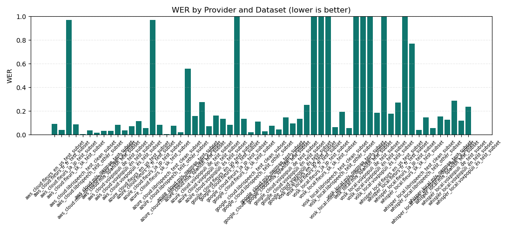
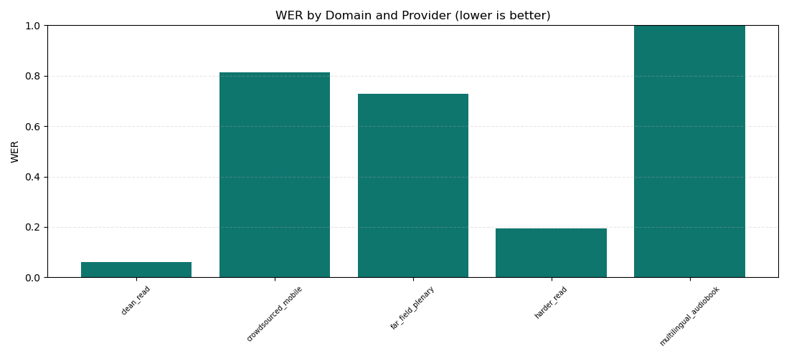
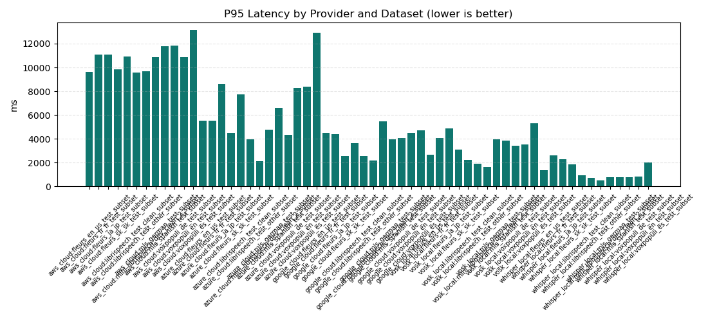
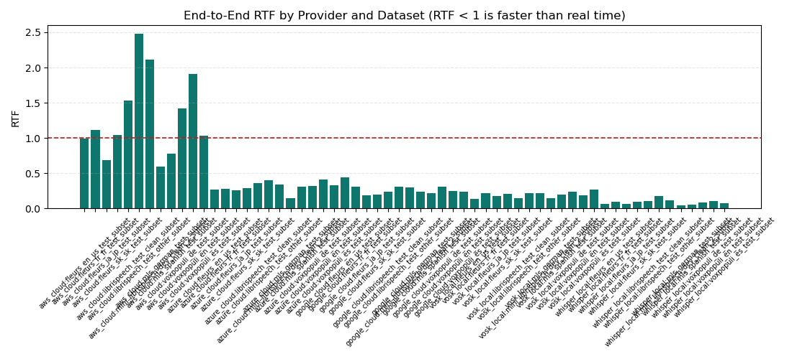
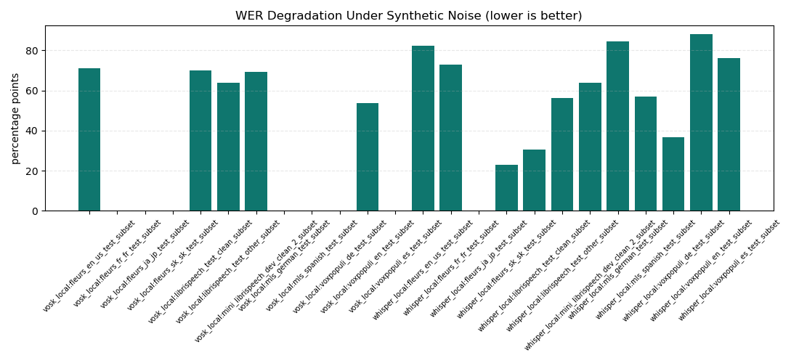
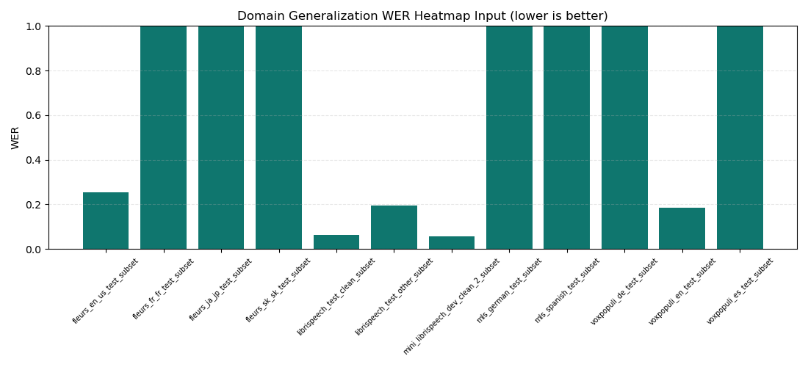
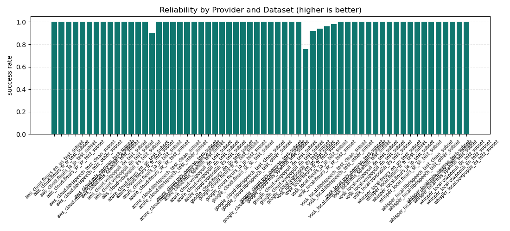
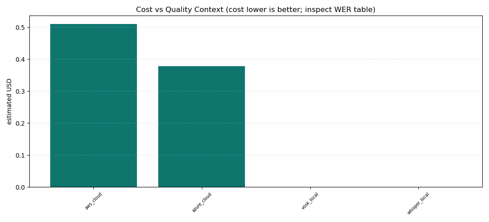
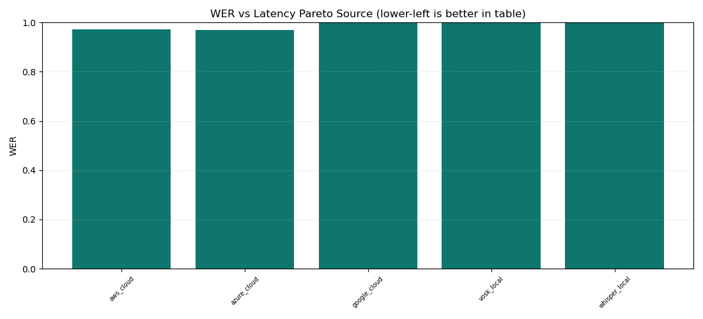

# Методика построения таблиц и графиков для thesis benchmark

Документ объясняет, откуда брались параметры, как они агрегировались в таблицы, как из таблиц появились графики и как эти графики читать. Основной набор артефактов находится в `results/thesis_extended/`. Базовый однонаборный результат оставлен в `results/thesis_final/`.

## Область графиков

Hugging Face исключен из финальных графиков по презентационному решению. Это сделано только на уровне PNG-визуализаций:

- строки `huggingface_local` и `huggingface_api` остаются в CSV-таблицах и raw-артефактах для трассируемости;
- графики в `results/thesis_extended/plots/` и `results/thesis_final/plots/` строятся без этих провайдеров;
- исходные benchmark-данные не удаляются.

Фильтр задан в скриптах:

- `scripts/export_thesis_extended_tables.py`: `PLOT_EXCLUDED_PROVIDERS`
- `scripts/export_thesis_tables.py`: `PLOT_EXCLUDED_PROVIDERS`

## Откуда берутся исходные данные

Расширенный экспорт читает директории `artifacts/benchmark_runs/thesis_ext_*`, в которых есть:

- `metrics/results.json` - построчные результаты распознавания;
- `reports/summary.json` - сводка запуска, dataset id и служебные параметры;
- `datasets/registry/datasets_extended.json` - описание датасетов, язык, акустический профиль и размер подмножества.

Каждая строка результата соответствует попытке распознавания одного аудиосэмпла одним провайдером/пресетом. Скрипт нормализует название провайдера через `_provider()`, добавляет metadata датасета и группирует строки по `provider`, `model`, `dataset`, `language`, `acoustic_profile`.

## Почему взяты эти датасеты

Используются маленькие валидированные thesis-scale подмножества, чтобы benchmark был воспроизводимым и не превращался в большой промышленный ASR evaluation. Они закрывают разные языки и акустические условия.

| dataset | language | domain/acoustic profile | samples | зачем нужен |
|---|---|---|---:|---|
| fleurs_en_us_test_subset | en-US | crowdsourced_mobile | 10 | мобильная/crowdsourced английская речь |
| fleurs_fr_fr_test_subset | fr-FR | crowdsourced_mobile | 10 | проверка французского языка |
| fleurs_ja_jp_test_subset | ja-JP | crowdsourced_mobile | 10 | стресс-тест для японского языка |
| fleurs_sk_sk_test_subset | sk-SK | crowdsourced_mobile | 10 | проверка словацкого языка |
| librispeech_test_clean_subset | en-US | clean_read | 10 | чистая английская read-speech baseline |
| librispeech_test_other_subset | en-US | harder_read | 10 | более сложная read-speech domain shift проверка |
| mini_librispeech_dev_clean_2_subset | en-US | clean_read | 10 | маленький чистый контрольный subset |
| mls_german_test_subset | de-DE | multilingual_audiobook | 10 | немецкая audiobook multilingual проверка |
| mls_spanish_test_subset | es-ES | multilingual_audiobook | 10 | испанская audiobook multilingual проверка |
| voxpopuli_de_test_subset | de-DE | far_field_plenary | 10 | немецкая far-field/plenary проверка |
| voxpopuli_en_test_subset | en-US | far_field_plenary | 10 | английская far-field/plenary проверка |
| voxpopuli_es_test_subset | es-ES | far_field_plenary | 10 | испанская far-field/plenary проверка |

## Основные итоговые числа

Эта таблица рассчитана из `results/thesis_extended/*.csv` после исключения Hugging Face из визуального сравнения. Значения являются средними по датасетам, поэтому их нельзя читать как абсолютного победителя во всех условиях: по отдельным языкам и доменам результат может отличаться. WER/CER в thesis export нормализуются в диапазон `0..1`, где `1.0` означает 100%.

| provider | mean WER | mean CER | mean RTF | mean P95 latency ms | mean success | cost type |
|---|---:|---:|---:|---:|---:|---|
| aws_cloud | 0.1259 | 0.0247 | 1.309 | 10856 | 1.000 | cloud_estimated |
| azure_cloud | 0.2129 | 0.1203 | 0.310 | 5863 | 0.992 | cloud_estimated |
| google_cloud | 0.1965 | 0.0472 | 0.270 | 4622 | 1.000 | cloud_not_estimated |
| vosk_local | 1.5715 | 0.5825 | 0.199 | 3380 | 0.963 | local_hardware_not_monetized |
| whisper_local | 0.2920 | 0.0990 | 0.090 | 1296 | 1.000 | local_hardware_not_monetized |

## Формулы и смысл метрик

| метрика | где лежит | как считается | что означает |
|---|---|---|---|
| `wer` | `quality_table.csv` | `min(sum(word_edits) / sum(reference_word_count), 1.0)` по успешным clean-строкам | Word Error Rate; ниже лучше; ограничен 100% |
| `cer` | `quality_table.csv` | `min(sum(char_edits) / sum(reference_char_count), 1.0)` | Character Error Rate; ниже лучше; ограничен 100% |
| `ser` | `quality_table.csv` | среднее `1.0`, если строка не exact match, иначе `0.0` | доля сэмплов с ошибкой на уровне предложения; ниже лучше |
| `exact_match_rate` | `quality_table.csv` | среднее `exact_match` | доля полностью совпавших нормализованных гипотез; выше лучше |
| `final_latency_ms_p50` | `performance_table.csv` | медиана `metrics.end_to_end_latency_ms` | типичная задержка до финального результата |
| `final_latency_ms_p95` | `performance_table.csv` | 95-й перцентиль `metrics.end_to_end_latency_ms` | верхняя граница задержки для большинства сэмплов; ниже лучше |
| `end_to_end_rtf_mean` | `performance_table.csv` | среднее `metrics.end_to_end_rtf` | real-time factor всего запроса; `< 1` быстрее реального времени |
| `end_to_end_rtf_p95` | `performance_table.csv` | 95-й перцентиль `metrics.end_to_end_rtf` | worst-case-ish RTF для большинства сэмплов |
| `throughput_audio_sec_per_sec` | `performance_table.csv` | `sum(audio_duration_sec) / sum(end_to_end_latency_ms / 1000)` | сколько секунд аудио обрабатывается за секунду wall-clock времени |
| `success_rate` | `reliability_table.csv` | `successful_attempts / total_attempts` | стабильность запуска провайдера на датасете; выше лучше |
| `noise_deg_pp` | `noise_robustness_table.csv` | `(max(noisy_wer) - clean_wer) * 100`, где WER уже ограничен `0..1` | деградация WER в процентных пунктах на шумовых вариантах; ниже лучше |
| `wer_delta_vs_clean_librispeech` | `domain_generalization_table.csv` | `dataset_wer - librispeech_test_clean_subset_wer` для того же provider/model | насколько домен хуже/лучше чистой baseline |
| `estimated_cost_usd` | `cost_deployment_table.csv` | сумма `metrics.estimated_cost_usd`; для local принудительно `0` | прямые API-затраты, если провайдер их отдаёт |
| `cost_per_audio_hour_usd` | `cost_deployment_table.csv` | `estimated_cost_usd / (total_audio_duration_sec / 3600)` | нормированная стоимость часа аудио |
| scenario scores | `scenario_scores.csv` | heuristic score из качества, RTF и local/cloud bonus | не научная метрика, а decision-support для сценариев |

## Как строятся таблицы

| таблица | группировка | входные поля | зачем нужна |
|---|---|---|---|
| `quality_table.csv` | provider, model, dataset, language, acoustic profile | `quality_support`, normalized text, success flag | качество распознавания на clean-строках |
| `performance_table.csv` | provider, model, dataset, language, acoustic profile | latency, RTF, duration | задержка, скорость и пригодность для near-real-time |
| `noise_robustness_table.csv` | provider, model, dataset, language, acoustic profile | `noise_snr_db`, WER | устойчивость к синтетическому шуму |
| `resource_table.csv` | provider, model, dataset | CPU/RAM/GPU metrics | оценка локальной нагрузки; для cloud это только client-side процесс |
| `cost_deployment_table.csv` | provider, model | duration, estimated cost, provider metadata | стоимость и эксплуатационные ограничения |
| `scenario_scores.csv` | provider, model | средний WER, средний RTF, local/cloud | эвристическая пригодность для embedded, batch, analytics, dialog |
| `domain_generalization_table.csv` | provider, model, dataset | WER, latency, RTF | отличие от clean LibriSpeech baseline |
| `reliability_table.csv` | provider, model, dataset, language, acoustic profile | success/error fields | стабильность и типы ошибок |
| `provider_dataset_matrix.csv` | provider, model, dataset | quality + performance + reliability | компактная матрица для Pareto/summary |
| `provider_language_matrix.csv` | provider, model, language | quality rows | обобщение по языкам |
| `provider_domain_matrix.csv` | provider, model, acoustic profile | quality rows | обобщение по акустическим доменам |

## Как из таблиц появляются графики

Все PNG создаются скриптом `scripts/export_thesis_extended_tables.py` из уже рассчитанных CSV-таблиц. Перед построением применяется фильтр:

```python
row.get("provider") not in PLOT_EXCLUDED_PROVIDERS
```

То есть графики получают те же метрики, что и таблицы, но без серий Hugging Face.

| график | исходная таблица | поле X | поле Y | как читать |
|---|---|---|---|---|
| `wer_by_provider_dataset.png` | `quality_table.csv` | `provider:dataset` | `wer` | качество по каждому датасету; ниже лучше; шкала `0..1` |
| `wer_by_language_provider.png` | `provider_language_matrix.csv` | `language` | `wer_mean` | средний WER по языкам; шкала `0..1`; показывает multilingual generalization |
| `wer_by_domain_provider.png` | `provider_domain_matrix.csv` | `acoustic_profile` | `wer_mean` | средний WER по акустическим доменам; шкала `0..1` |
| `latency_p95_by_provider_dataset.png` | `performance_table.csv` | `provider:dataset` | `final_latency_ms_p95` | худшая типичная задержка; ниже лучше |
| `rtf_by_provider_dataset.png` | `performance_table.csv` | `provider:dataset` | `end_to_end_rtf_mean` | скорость относительно real time; линия `1.0` означает реальное время |
| `noise_robustness_by_dataset_provider.png` | `noise_robustness_table.csv` | `provider:dataset` | `noise_deg_pp` | насколько WER ухудшается от шума; ниже лучше |
| `domain_generalization_heatmap_wer.png` | `quality_table.csv` | `dataset` | `wer` | вход для domain generalization view; шкала `0..1`; сейчас рендерится как bar chart |
| `language_generalization_heatmap_wer.png` | `provider_language_matrix.csv` | `language` | `wer_mean` | вход для language generalization view; шкала `0..1`; сейчас рендерится как bar chart |
| `reliability_by_provider_dataset.png` | `reliability_table.csv` | `provider:dataset` | `success_rate` | доля успешных попыток; выше лучше |
| `cost_vs_quality_extended.png` | `cost_deployment_table.csv` | `provider` | `estimated_cost_usd` | контекст стоимости; качество нужно смотреть вместе с WER |
| `wer_vs_latency_pareto_extended.png` | `provider_dataset_matrix.csv` | `provider` | `wer` | источник Pareto-анализа; WER шкала `0..1`; лучший компромисс ближе к low WER + low latency |

## Графики

### WER по provider/dataset



Показывает точность распознавания для каждого провайдера на каждом датасете. Шкала графика ограничена диапазоном `0..1`, то есть максимумом 100%. Это главный график качества, но его нужно читать вместе с языком и доменом: высокий WER может быть следствием language/model mismatch.


### WER по акустическим доменам



Сравнивает clean read speech, harder read speech, mobile/crowdsourced, audiobook и far-field plenary условия. Шкала WER ограничена `0..1`. Нужен для вывода, что качество зависит не только от провайдера, но и от акустического профиля.

### P95 latency



Показывает задержку до финального результата на 95-м перцентиле. Для robot/ROS2 сценариев это важнее среднего, потому что редкие длинные задержки ломают interactive behavior.

### Real-time factor



RTF показывает отношение времени обработки к длительности аудио. Значение ниже `1.0` означает быстрее реального времени; выше `1.0` означает, что система не успевает за живым потоком без буферизации.

### Устойчивость к шуму



График показывает не абсолютный WER, а ухудшение WER относительно clean-варианта. Это важно для лабораторных/робототехнических условий, где шум микрофона и окружения может быть главным фактором.

### Domain generalization



Файл назван `heatmap`, но текущий экспорт рисует bar chart. Смысл графика - показать, на каких датасетах WER растёт относительно чистой baseline.


### Reliability



Показывает долю успешных попыток. Провайдер с хорошим WER, но нестабильными запусками, хуже подходит для ROS2 pipeline, чем это видно только по quality table.

### Cost context



Показывает прямые оценённые API-затраты. Для local providers direct API cost равен нулю, но железо, установка и обслуживание не монетизированы, поэтому это не полный TCO.

### Pareto source



Используется как компактный источник для анализа trade-off между качеством и задержкой. Лучшие варианты находятся ближе к низкому WER и низкой latency, но окончательное решение зависит от сценария.

## Интерпретация для ROS2/COCOHRIP

Для офлайн и воспроизводимых ROS2-экспериментов важны `offline_capable`, отсутствие credentials, низкий RTF и стабильный success rate. Поэтому local providers полезны как контролируемая baseline-система.

Cloud providers дают сильное качество на части датасетов, но требуют интернет, credentials и имеют network-dependent latency. Их лучше рассматривать как connected baseline или как опциональный режим, а не как единственный runtime для робототехнической системы.

## Ограничения

- Подмножества маленькие и thesis-scale; это не замена full-corpus evaluation.
- Синтетический шум не покрывает все реальные шумы микрофона, комнаты и робота.
- Cloud latency зависит от сети, региона и текущего состояния сервиса.
- Для cloud resource metrics показывают client-side процесс, а не серверную нагрузку провайдера.
- Scenario scores являются эвристикой для принятия решения, а не отдельной научной метрикой.
- Hugging Face исключен только из графиков, но оставлен в CSV для воспроизводимости и проверки.
