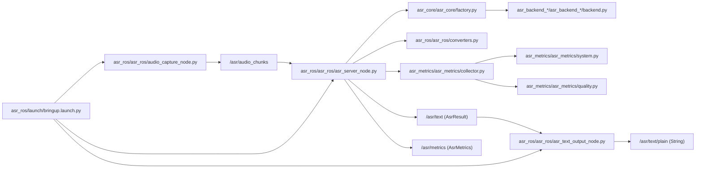
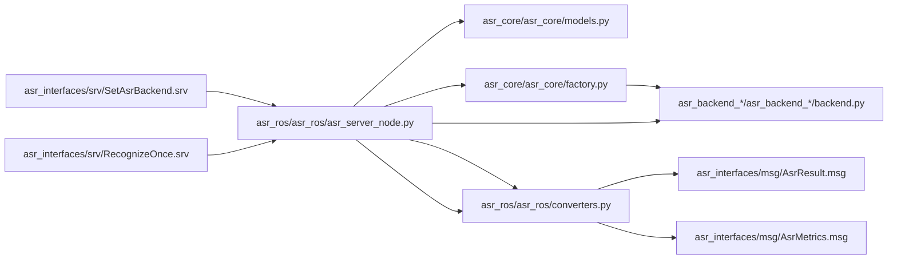
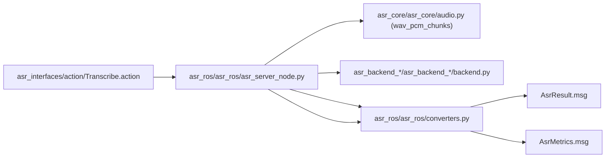
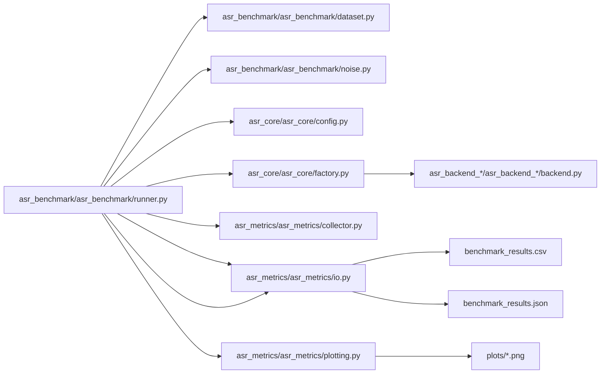
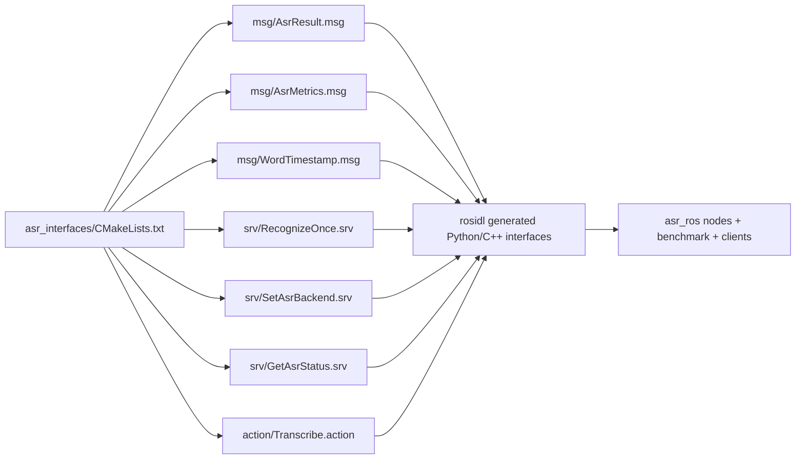

# File Flows (Mermaid)

Диаграммы ниже показывают, какие именно файлы в `ros2_ws/src` участвуют
в основных runtime-сценариях.

## 1) Live Bringup: mic/file -> /asr/text/plain + /asr/metrics

## 2) Service Path: /asr/recognize_once + /asr/set_backend

## 3) Action Path: /asr/transcribe (streaming/non-streaming)

## 4) Benchmark Pipeline: dataset/scenarios -> CSV/JSON/plots

## 5) Interfaces Build Flow (type generation)

## Связанные

- [[99_Maps/Project_Map]]
- [[99_Maps/Runtime_Map]]
- [[99_Maps/Code_Map]]
- [[02_ROS2/Runtime_Flow]]
