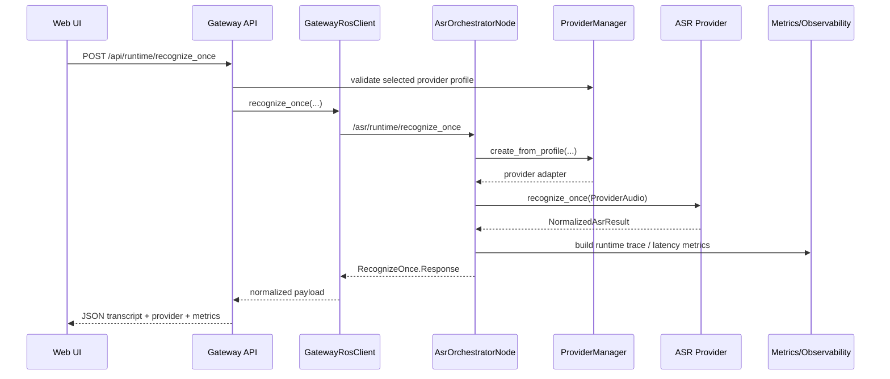

# Current Pipeline

Audit date: `2026-04-01`

This document captures the current canonical execution path in the repository after the Hugging Face integration work. It describes the real runtime stack that the web UI uses today:

`GUI -> gateway API -> ROS2 runtime orchestrator -> provider adapter -> normalized result -> metrics/artifacts`

## Repository Areas

- `web_ui/frontend/js/pages/runtime.js`: runtime page state, provider selection, file upload, recognize-once trigger
- `ros2_ws/src/asr_gateway/asr_gateway/api.py`: HTTP API surface for GUI and scripts
- `ros2_ws/src/asr_gateway/asr_gateway/ros_client.py`: gateway bridge to ROS2 services and runtime observer topics
- `ros2_ws/src/asr_runtime_nodes/asr_runtime_nodes/asr_orchestrator_node.py`: runtime control plane and provider invocation
- `ros2_ws/src/asr_provider_base/*`: provider contract, provider manager, registry, plugin discovery
- `ros2_ws/src/asr_provider_*/*`: concrete provider adapters
- `ros2_ws/src/asr_benchmark_core/*`: benchmark orchestration
- `ros2_ws/src/asr_metrics/*`: WER/CER/latency metrics and observability exports

## Canonical Service Contracts

The current runtime stack is built around these ROS2 service endpoints:

- `/asr/runtime/recognize_once`
- `/asr/runtime/start_session`
- `/asr/runtime/stop_session`
- `/asr/runtime/reconfigure`
- `/asr/runtime/list_backends`
- `/asr/runtime/get_status`
- `/config/list_profiles`
- `/config/validate`

The gateway exposes the browser-facing HTTP equivalents under `/api/runtime/*`, `/api/providers/*`, `/api/config/*`, and `/api/benchmark/*`.

## Recognize-Once Flow

### 1. GUI

The browser runtime page loads provider/profile metadata from:

- `GET /api/runtime/backends`
- `GET /api/providers/catalog`
- `GET /api/runtime/samples`
- `GET /api/runtime/live`

When the operator clicks `Transcribe Whole File`, `recognizeOnce()` in `runtime.js` builds a JSON payload containing:

- `wav_path`
- `language`
- `session_id`
- `provider_profile`
- `provider_preset`
- `provider_settings`

### 2. Gateway

`POST /api/runtime/recognize_once` in `asr_gateway/api.py`:

- validates the selected provider profile with `ProviderManager`
- validates the selected WAV path
- converts JSON into a `RecognizeOnce.Request`
- forwards the request through `GatewayRosClient.recognize_once()`

The gateway is also the place where the provider catalog is built for the UI. It merges:

- declared providers from `asr_provider_base.list_providers(...)`
- live provider IDs returned by `/asr/runtime/list_backends`
- provider profile status from `configs/providers/*.yaml`

### 3. ROS2 Runtime

`AsrOrchestratorNode._on_recognize_once()` performs the runtime-side work:

- resolves runtime/provider configuration
- resolves provider preset and setting overrides
- loads input audio bytes from disk
- creates or reuses a provider adapter through `ProviderManager`
- calls `provider.recognize_once(ProviderAudio(...))`
- converts `NormalizedAsrResult` to the ROS message contract
- publishes the final result topic
- returns the service response

The orchestrator preserves the normalized result contract for all providers, including:

- `text`
- `language`
- `words`
- `confidence`
- `timestamps_available`
- `latency.*`
- `error_code` / `error_message`
- `degraded`

### 4. Provider Layer

The provider layer is already adapter-based:

- `asr_provider_whisper`
- `asr_provider_azure`
- `asr_provider_google`
- `asr_provider_aws`
- `asr_provider_vosk`
- `asr_provider_huggingface`

Every provider receives `ProviderAudio` and returns `NormalizedAsrResult`. This is the compatibility point used by:

- runtime services
- live runtime topics
- gateway JSON serialization
- benchmark execution

### 5. Result and Metrics

On the runtime path, the orchestrator builds observability data with `PipelineTraceCollector` and `build_runtime_trace(...)`. The main comparable latency signals are:

- `preprocess_ms`
- `inference_ms`
- `postprocess_ms`
- `total_latency_ms`
- `time_to_result_ms`
- `real_time_factor`

On the benchmark path, `BenchmarkOrchestrator` and `MetricEngine` compute:

- `wer`
- `cer`
- `sample_accuracy`
- `total_latency_ms`
- `real_time_factor`
- `success_rate`
- `estimated_cost_usd`

## Live Runtime Session Flow

The session path is similar but topic-driven:

1. GUI calls `POST /api/runtime/start`
2. Gateway calls `/asr/runtime/start_session`
3. `audio_input_node` publishes raw audio chunks
4. `audio_preprocess_node` normalizes/resamples chunks
5. `vad_segmenter_node` emits `AudioSegment`
6. `AsrOrchestratorNode._on_segment()` invokes the selected provider
7. orchestrator publishes partial/final result topics
8. `GatewayRosClient.RuntimeObserver` feeds `/api/runtime/live`
9. GUI polls `/api/runtime/live` and renders transcript/timeline/status

## Benchmark Flow

The benchmark path reuses the same normalized provider contract:

1. CLI, gateway, or ROS action starts a benchmark run
2. `BenchmarkOrchestrator` resolves dataset, provider, and metric profiles
3. provider adapters are instantiated through `ProviderManager`
4. `executor.run_sample()` or `executor.run_sample_streaming()` calls the provider
5. `MetricEngine` computes quality/latency metrics from the normalized result
6. artifacts are persisted under `artifacts/benchmark_runs/<run_id>/...`
7. exported summaries are copied to `reports/benchmarks/<run_id>/...`

## Current End-to-End Data Flow

## Main Current-State Conclusions

- The runtime stack is already normalized around `ProviderAudio -> NormalizedAsrResult`.
- The gateway is the control-plane aggregator for GUI, configs, profiles, logs, and runtime state.
- The orchestrator is the execution boundary where provider selection becomes concrete.
- The benchmark system already consumes provider outputs through a provider-neutral contract.
- The remaining architectural gap before this work was missing first-class plugin discovery and first-class Hugging Face providers. Those are addressed in the target design and implementation.
