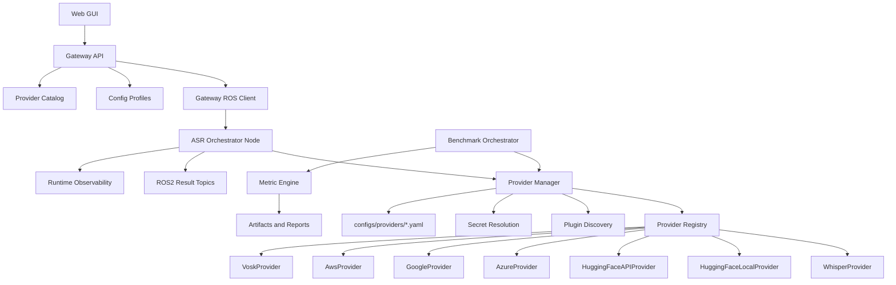
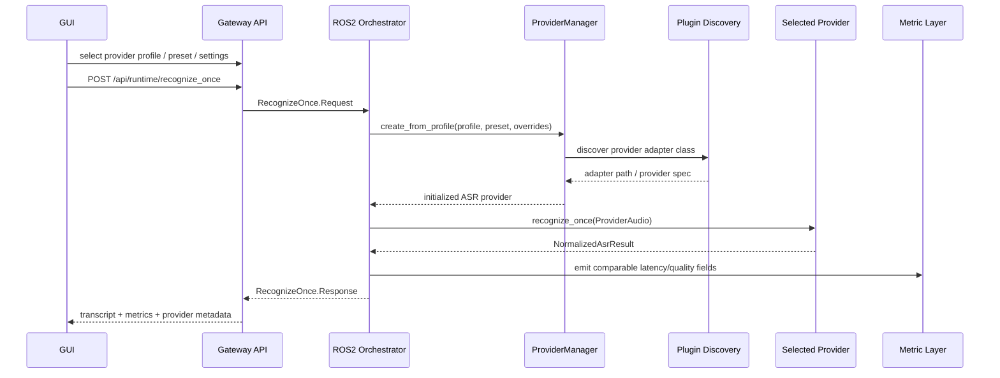

# Target Architecture

Design date: `2026-04-01`

The target state is a universal ASR platform where providers are interchangeable through configuration, loaded dynamically, and exposed through one stable adapter contract.

## Design Goals

- one provider-neutral runtime contract for ROS2, gateway, GUI, and benchmark code
- plug-in addition without editing orchestrator or gateway code
- config-based provider switching
- comparable metrics across local and cloud providers
- Hugging Face support as a first-class provider family

## Core Abstractions

### 1. Unified ASR Interface

All providers implement the `AsrProviderAdapter` contract from `asr_provider_base/adapter.py`.

Required execution methods:

```python
class ASRProvider:
    def initialize(self, config: dict[str, Any], credentials_ref: dict[str, str]) -> None: ...
    def validate_config(self) -> list[str]: ...
    def discover_capabilities(self) -> ProviderCapabilities: ...
    def recognize_once(
        self,
        audio: ProviderAudio,
        options: dict[str, Any] | None = None,
    ) -> NormalizedAsrResult: ...
    def start_stream(self, options: dict[str, Any] | None = None) -> None: ...
    def push_audio(self, chunk: bytes) -> NormalizedAsrResult | None: ...
    def stop_stream(self) -> NormalizedAsrResult: ...
    def stream_recognize(
        self,
        chunks: list[bytes],
        options: dict[str, Any] | None = None,
    ) -> list[NormalizedAsrResult]: ...
    def get_status(self) -> ProviderStatus: ...
    def get_metadata(self) -> ProviderMetadata: ...
    def get_metrics(self) -> ProviderRuntimeMetrics: ...
    def teardown(self) -> None: ...
```

### 2. Data Contracts

Input contract:

- `ProviderAudio`
  - `session_id`
  - `request_id`
  - `language`
  - `sample_rate_hz`
  - `audio_bytes` or `wav_path`
  - `enable_word_timestamps`
  - `metadata`

Output contract:

- `NormalizedAsrResult`
  - transcript text
  - words with timestamps
  - confidence
  - language
  - degraded/error fields
  - latency breakdown

Provider metadata contract:

- `ProviderMetadata`
  - `provider_id`
  - `display_name`
  - `implementation`
  - `model_id`
  - `endpoint`
  - `device`
  - `source`

Provider runtime metrics contract:

- `ProviderRuntimeMetrics`
  - `model_load_ms`
  - `requests_total`
  - `stream_sessions_total`
  - `last_latency_ms`
  - `average_latency_ms`
  - `errors_total`
  - `last_error_code`
  - `last_error_message`

### 3. Plugin System

Dynamic loading is implemented in `asr_provider_base/providers/plugins.py` and `registry.py`.

Discovery sources:

- built-in registry registrations
- provider YAML profiles with explicit `adapter: module.Class`
- environment variable `ASR_PROVIDER_PLUGIN_MODULES`

Supported configuration patterns:

```yaml
profile_id: providers/huggingface_local
provider_id: huggingface_local
adapter: asr_provider_huggingface.local_provider.HuggingFaceLocalProvider
```

```bash
export ASR_PROVIDER_PLUGIN_MODULES="custom_provider=my_pkg.adapters.CustomProvider"
```

This means a new provider can be added by:

1. shipping a Python adapter class
2. registering it in a provider YAML profile or env var
3. selecting it in runtime or benchmark config

No orchestrator or gateway code changes are required.

## Provider Families

### Implemented

- `HuggingFaceLocalProvider`
- `HuggingFaceAPIProvider`
- `WhisperProvider`
- `AzureProvider`
- `GoogleProvider`
- existing AWS/Vosk providers continue to work through the same interface

### Hugging Face Modes

`HuggingFaceLocalProvider`

- uses `transformers.pipeline("automatic-speech-recognition")`
- supports local Whisper and wav2vec2-style models
- resolves `cpu` / `cuda` / `mps`
- optional HF token for gated model download

`HuggingFaceAPIProvider`

- uses the Hugging Face Inference API over HTTP
- supports `model_id`, `endpoint_url`, timeout, and generation parameters
- uses `HF_TOKEN`
- preserves the same normalized result contract as local mode

## ROS2 Integration

The orchestrator now resolves provider selection from either:

- legacy `orchestrator.provider_profile`
- new `providers.active`

Additional runtime selection fields:

- `providers.preset`
- `providers.settings`

Example:

```yaml
providers:
  active: providers/huggingface_local
  preset: balanced
  settings:
    device: auto
```

Runtime behavior:

1. gateway sends provider selection from GUI or runtime profile
2. orchestrator resolves the target provider profile and preset
3. `ProviderManager` creates the adapter dynamically
4. ROS2 services and topics continue using the existing message schema
5. only the provider implementation changes underneath

## Benchmark Integration

The benchmark layer remains provider-neutral because each provider returns `NormalizedAsrResult`.

Comparable metrics across providers:

- `wer`
- `cer`
- `sample_accuracy`
- `total_latency_ms`
- `real_time_factor`
- `confidence`
- `success_rate`

The provider-specific runtime metrics are supplemental and do not break cross-provider comparison.

## Component Diagram



## Sequence Diagram



## Concrete Configuration Model

Implemented configuration surfaces:

- `configs/providers/*.yaml`
- `configs/runtime/*.yaml`
- `configs/benchmark/*.yaml`
- `secrets/refs/*.yaml`
- environment variables for secrets and plugin injection

Key selectable fields:

- provider selection
- model id / model size
- preset
- CPU vs GPU device
- endpoint URL
- API token
- provider-specific advanced settings

## Production Readiness Notes

- provider creation is isolated in `ProviderManager`
- provider selection is configuration-driven
- benchmark compatibility is preserved through normalized outputs
- gateway/provider catalog now surfaces Hugging Face as local and cloud modes
- tests cover plugin discovery, provider contracts, runtime selection, and gateway catalog behavior
